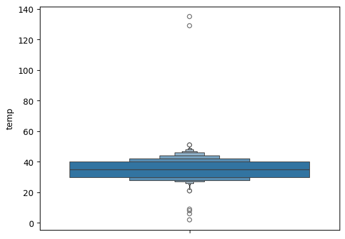
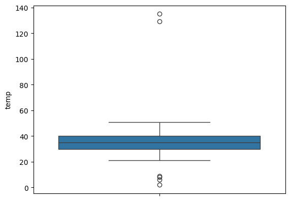
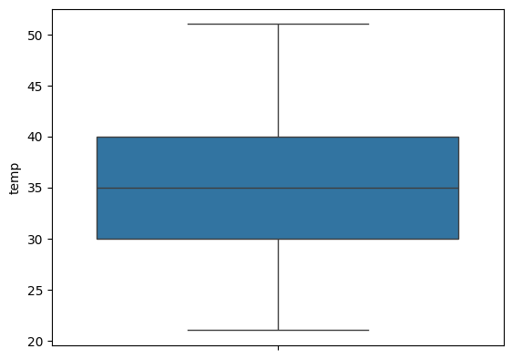
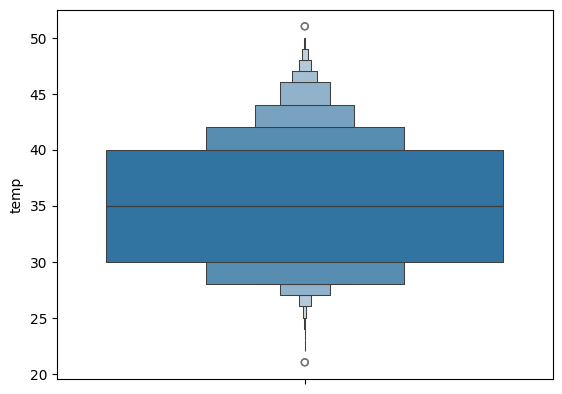
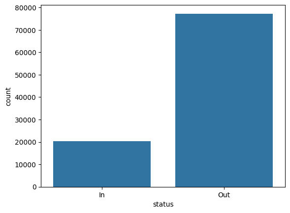
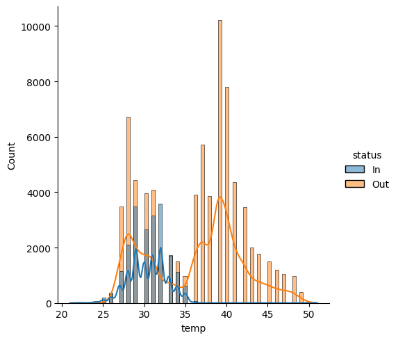

# DS-workshop-Data-Cleaning-and-Data-Analysis

### CODING AND OUTPUT
```python
import pandas as pd
import numpy as np
import seaborn as sns
df = pd.read_csv('temp.csv')
df
```


<div id="df-9a1ec825-2d5b-41ec-b67f-f3385251aa2b" class="colab-df-container">
<div>
<table border="1" class="dataframe">
<thead>
<tr style="text-align: right;">
<th></th>
<th>id</th>
<th>room_id</th>
<th>noted_date</th>
<th>temp</th>
<th>out/in</th>
</tr>
</thead>
<tbody>
<tr>
<th>0</th>
<td>__export__.temp_log_196134_bd201015</td>
<td>Room Admin</td>
<td>08/12/2018 09:30</td>
<td>29.0</td>
<td>In</td>
</tr>
<tr>
<th>1</th>
<td>__export__.temp_log_196131_7bca51bc</td>
<td>Room Admin</td>
<td>08/12/2018 09:30</td>
<td>29.0</td>
<td>In</td>
</tr>
<tr>
<th>2</th>
<td>__export__.temp_log_196127_522915e3</td>
<td>Room Admin</td>
<td>08/12/2018 09:29</td>
<td>41.0</td>
<td>Out</td>
</tr>
<tr>
<th>3</th>
<td>__export__.temp_log_196128_be0919cf</td>
<td>Room Admin</td>
<td>08/12/2018 09:29</td>
<td>41.0</td>
<td>Out</td>
</tr>
<tr>
<th>4</th>
<td>__export__.temp_log_196126_d30b72fb</td>
<td>Room Admin</td>
<td>08/12/2018 09:29</td>
<td>31.0</td>
<td>In</td>
</tr>
<tr>
<th>...</th>
<td>...</td>
<td>...</td>
<td>...</td>
<td>...</td>
<td>...</td>
</tr>
<tr>
<th>97601</th>
<td>__export__.temp_log_91076_7fbd08ca</td>
<td>Room Admin</td>
<td>28/07/2018 07:07</td>
<td>31.0</td>
<td>In</td>
</tr>
<tr>
<th>97602</th>
<td>__export__.temp_log_147733_62c03f31</td>
<td>Room Admin</td>
<td>28/07/2018 07:07</td>
<td>31.0</td>
<td>In</td>
</tr>
<tr>
<th>97603</th>
<td>__export__.temp_log_100386_84093a68</td>
<td>Room Admin</td>
<td>28/07/2018 07:06</td>
<td>31.0</td>
<td>In</td>
</tr>
<tr>
<th>97604</th>
<td>__export__.temp_log_123297_4d8e690b</td>
<td>Room Admin</td>
<td>28/07/2018 07:06</td>
<td>31.0</td>
<td>In</td>
</tr>
<tr>
<th>97605</th>
<td>__export__.temp_log_133741_32958703</td>
<td>Room Admin</td>
<td>28/07/2018 07:06</td>
<td>31.0</td>
<td>In</td>
</tr>
</tbody>
</table>
<p>97606 rows × 5 columns</p>
</div>
<div class="colab-df-buttons">

<div class="colab-df-container">
<button class="colab-df-convert" onclick="convertToInteractive('df-9a1ec825-2d5b-41ec-b67f-f3385251aa2b')"
title="Convert this dataframe to an interactive table."
style="display:none;">

</button>


</div>


<div id="id_97c5f255-8c9f-4172-8f59-eab479666bd2">
<button class="colab-df-generate" onclick="generateWithVariable('df')"
title="Generate code using this dataframe."
style="display:none;">

</button>
</div>

</div>
</div>


```python
df.shape
```


(97606, 5)


```python
df.describe()
```


<div id="df-1c6d6b30-0b59-4841-a9e8-c668f66407f7" class="colab-df-container">
<div>
<table border="1" class="dataframe">
<thead>
<tr style="text-align: right;">
<th></th>
<th>temp</th>
</tr>
</thead>
<tbody>
<tr>
<th>count</th>
<td>97601.000000</td>
</tr>
<tr>
<th>mean</th>
<td>35.054948</td>
</tr>
<tr>
<th>std</th>
<td>5.719685</td>
</tr>
<tr>
<th>min</th>
<td>2.000000</td>
</tr>
<tr>
<th>25%</th>
<td>30.000000</td>
</tr>
<tr>
<th>50%</th>
<td>35.000000</td>
</tr>
<tr>
<th>75%</th>
<td>40.000000</td>
</tr>
<tr>
<th>max</th>
<td>135.000000</td>
</tr>
</tbody>
</table>
</div>
<div class="colab-df-buttons">

<div class="colab-df-container">
<button class="colab-df-convert" onclick="convertToInteractive('df-1c6d6b30-0b59-4841-a9e8-c668f66407f7')"
title="Convert this dataframe to an interactive table."
style="display:none;">

</button>


</div>


</div>
</div>


```python
df.info()
```


```python
df.isna().sum()
```


<div>
<table border="1" class="dataframe">
<thead>
<tr style="text-align: right;">
<th></th>
<th>0</th>
</tr>
</thead>
<tbody>
<tr>
<th>id</th>
<td>0</td>
</tr>
<tr>
<th>room_id</th>
<td>0</td>
</tr>
<tr>
<th>noted_date</th>
<td>3</td>
</tr>
<tr>
<th>temp</th>
<td>5</td>
</tr>
<tr>
<th>out/in</th>
<td>5</td>
</tr>
</tbody>
</table>
</div><br><label><b>dtype:</b> int64</label>


```python
df['noted_date'].fillna(method='ffill',inplace=True)
df.isna().sum()
```

/tmp/ipython-input-3613663971.py:1: FutureWarning: A value is trying to be set on a copy of a DataFrame or Series through chained assignment using an inplace method.
The behavior will change in pandas 3.0. This inplace method will never work because the intermediate object on which we are setting values always behaves as a copy.

For example, when doing 'df[col].method(value, inplace=True)', try using 'df.method({col: value}, inplace=True)' or df[col] = df[col].method(value) instead, to perform the operation inplace on the original object.


df['noted_date'].fillna(method='ffill',inplace=True)
/tmp/ipython-input-3613663971.py:1: FutureWarning: Series.fillna with 'method' is deprecated and will raise in a future version. Use obj.ffill() or obj.bfill() instead.
df['noted_date'].fillna(method='ffill',inplace=True)


<div>
<table border="1" class="dataframe">
<thead>
<tr style="text-align: right;">
<th></th>
<th>0</th>
</tr>
</thead>
<tbody>
<tr>
<th>id</th>
<td>0</td>
</tr>
<tr>
<th>room_id</th>
<td>0</td>
</tr>
<tr>
<th>noted_date</th>
<td>0</td>
</tr>
<tr>
<th>temp</th>
<td>5</td>
</tr>
<tr>
<th>out/in</th>
<td>5</td>
</tr>
</tbody>
</table>
</div><br><label><b>dtype:</b> int64</label>


```python
tp=df['temp'].median()
tp
```


35.0


```python
df['temp'].fillna(tp,inplace=True)
df.isna().sum()
```

/tmp/ipython-input-1724623039.py:1: FutureWarning: A value is trying to be set on a copy of a DataFrame or Series through chained assignment using an inplace method.
The behavior will change in pandas 3.0. This inplace method will never work because the intermediate object on which we are setting values always behaves as a copy.

For example, when doing 'df[col].method(value, inplace=True)', try using 'df.method({col: value}, inplace=True)' or df[col] = df[col].method(value) instead, to perform the operation inplace on the original object.


df['temp'].fillna(tp,inplace=True)


<div>
<table border="1" class="dataframe">
<thead>
<tr style="text-align: right;">
<th></th>
<th>0</th>
</tr>
</thead>
<tbody>
<tr>
<th>id</th>
<td>0</td>
</tr>
<tr>
<th>room_id</th>
<td>0</td>
</tr>
<tr>
<th>noted_date</th>
<td>0</td>
</tr>
<tr>
<th>temp</th>
<td>0</td>
</tr>
<tr>
<th>out/in</th>
<td>5</td>
</tr>
</tbody>
</table>
</div><br><label><b>dtype:</b> int64</label>


```python
df.rename(columns={'out/in':'status'},inplace=True)
df['status'].fillna(method='bfill',inplace=True)
df.isna().sum()
```

/tmp/ipython-input-1683749153.py:2: FutureWarning: A value is trying to be set on a copy of a DataFrame or Series through chained assignment using an inplace method.
The behavior will change in pandas 3.0. This inplace method will never work because the intermediate object on which we are setting values always behaves as a copy.

For example, when doing 'df[col].method(value, inplace=True)', try using 'df.method({col: value}, inplace=True)' or df[col] = df[col].method(value) instead, to perform the operation inplace on the original object.


df['status'].fillna(method='bfill',inplace=True)
/tmp/ipython-input-1683749153.py:2: FutureWarning: Series.fillna with 'method' is deprecated and will raise in a future version. Use obj.ffill() or obj.bfill() instead.
df['status'].fillna(method='bfill',inplace=True)


<div>
<table border="1" class="dataframe">
<thead>
<tr style="text-align: right;">
<th></th>
<th>0</th>
</tr>
</thead>
<tbody>
<tr>
<th>id</th>
<td>0</td>
</tr>
<tr>
<th>room_id</th>
<td>0</td>
</tr>
<tr>
<th>noted_date</th>
<td>0</td>
</tr>
<tr>
<th>temp</th>
<td>0</td>
</tr>
<tr>
<th>status</th>
<td>0</td>
</tr>
</tbody>
</table>
</div><br><label><b>dtype:</b> int64</label>


```python
sns.boxenplot(data=df,y='temp')
```


<Axes: ylabel='temp'>





```python
sns.boxplot(data=df,y='temp')
```


<Axes: ylabel='temp'>





```python
q3=np.percentile(df['temp'],75)
q1=np.percentile(df['temp'],25)
iqr=q3-q1
iqr
```


np.float64(10.0)


```python
lb=q1-1.5*iqr
hb=q3+1.5*iqr
```


```python
lb
```


np.float64(15.0)


```python
hb
```


np.float64(55.0)


```python
df=df[(df.temp>=lb)&(df.temp<=hb)]
df
```


<div id="df-e1c3d6c9-047a-4e12-9654-3180ba95303a" class="colab-df-container">
<div>
<table border="1" class="dataframe">
<thead>
<tr style="text-align: right;">
<th></th>
<th>id</th>
<th>room_id</th>
<th>noted_date</th>
<th>temp</th>
<th>status</th>
</tr>
</thead>
<tbody>
<tr>
<th>0</th>
<td>__export__.temp_log_196134_bd201015</td>
<td>Room Admin</td>
<td>08/12/2018 09:30</td>
<td>29.0</td>
<td>In</td>
</tr>
<tr>
<th>1</th>
<td>__export__.temp_log_196131_7bca51bc</td>
<td>Room Admin</td>
<td>08/12/2018 09:30</td>
<td>29.0</td>
<td>In</td>
</tr>
<tr>
<th>2</th>
<td>__export__.temp_log_196127_522915e3</td>
<td>Room Admin</td>
<td>08/12/2018 09:29</td>
<td>41.0</td>
<td>Out</td>
</tr>
<tr>
<th>3</th>
<td>__export__.temp_log_196128_be0919cf</td>
<td>Room Admin</td>
<td>08/12/2018 09:29</td>
<td>41.0</td>
<td>Out</td>
</tr>
<tr>
<th>4</th>
<td>__export__.temp_log_196126_d30b72fb</td>
<td>Room Admin</td>
<td>08/12/2018 09:29</td>
<td>31.0</td>
<td>In</td>
</tr>
<tr>
<th>...</th>
<td>...</td>
<td>...</td>
<td>...</td>
<td>...</td>
<td>...</td>
</tr>
<tr>
<th>97601</th>
<td>__export__.temp_log_91076_7fbd08ca</td>
<td>Room Admin</td>
<td>28/07/2018 07:07</td>
<td>31.0</td>
<td>In</td>
</tr>
<tr>
<th>97602</th>
<td>__export__.temp_log_147733_62c03f31</td>
<td>Room Admin</td>
<td>28/07/2018 07:07</td>
<td>31.0</td>
<td>In</td>
</tr>
<tr>
<th>97603</th>
<td>__export__.temp_log_100386_84093a68</td>
<td>Room Admin</td>
<td>28/07/2018 07:06</td>
<td>31.0</td>
<td>In</td>
</tr>
<tr>
<th>97604</th>
<td>__export__.temp_log_123297_4d8e690b</td>
<td>Room Admin</td>
<td>28/07/2018 07:06</td>
<td>31.0</td>
<td>In</td>
</tr>
<tr>
<th>97605</th>
<td>__export__.temp_log_133741_32958703</td>
<td>Room Admin</td>
<td>28/07/2018 07:06</td>
<td>31.0</td>
<td>In</td>
</tr>
</tbody>
</table>
<p>97600 rows × 5 columns</p>
</div>
<div class="colab-df-buttons">

<div class="colab-df-container">
<button class="colab-df-convert" onclick="convertToInteractive('df-e1c3d6c9-047a-4e12-9654-3180ba95303a')"
title="Convert this dataframe to an interactive table."
style="display:none;">

</button>


</div>


<div id="id_def5d78f-590f-4383-9344-4eca8fe003ca">
<button class="colab-df-generate" onclick="generateWithVariable('df')"
title="Generate code using this dataframe."
style="display:none;">

</button>
</div>

</div>
</div>


```python
df.dropna(inplace=True)
df
```

/tmp/ipython-input-955798070.py:1: SettingWithCopyWarning: 
A value is trying to be set on a copy of a slice from a DataFrame

See the caveats in the documentation: https://pandas.pydata.org/pandas-docs/stable/user_guide/indexing.html#returning-a-view-versus-a-copy
df.dropna(inplace=True)


<div id="df-d530c5f1-0cdf-4a31-a1da-f7ecff49a54a" class="colab-df-container">
<div>
<table border="1" class="dataframe">
<thead>
<tr style="text-align: right;">
<th></th>
<th>id</th>
<th>room_id</th>
<th>noted_date</th>
<th>temp</th>
<th>status</th>
</tr>
</thead>
<tbody>
<tr>
<th>0</th>
<td>__export__.temp_log_196134_bd201015</td>
<td>Room Admin</td>
<td>08/12/2018 09:30</td>
<td>29.0</td>
<td>In</td>
</tr>
<tr>
<th>1</th>
<td>__export__.temp_log_196131_7bca51bc</td>
<td>Room Admin</td>
<td>08/12/2018 09:30</td>
<td>29.0</td>
<td>In</td>
</tr>
<tr>
<th>2</th>
<td>__export__.temp_log_196127_522915e3</td>
<td>Room Admin</td>
<td>08/12/2018 09:29</td>
<td>41.0</td>
<td>Out</td>
</tr>
<tr>
<th>3</th>
<td>__export__.temp_log_196128_be0919cf</td>
<td>Room Admin</td>
<td>08/12/2018 09:29</td>
<td>41.0</td>
<td>Out</td>
</tr>
<tr>
<th>4</th>
<td>__export__.temp_log_196126_d30b72fb</td>
<td>Room Admin</td>
<td>08/12/2018 09:29</td>
<td>31.0</td>
<td>In</td>
</tr>
<tr>
<th>...</th>
<td>...</td>
<td>...</td>
<td>...</td>
<td>...</td>
<td>...</td>
</tr>
<tr>
<th>97601</th>
<td>__export__.temp_log_91076_7fbd08ca</td>
<td>Room Admin</td>
<td>28/07/2018 07:07</td>
<td>31.0</td>
<td>In</td>
</tr>
<tr>
<th>97602</th>
<td>__export__.temp_log_147733_62c03f31</td>
<td>Room Admin</td>
<td>28/07/2018 07:07</td>
<td>31.0</td>
<td>In</td>
</tr>
<tr>
<th>97603</th>
<td>__export__.temp_log_100386_84093a68</td>
<td>Room Admin</td>
<td>28/07/2018 07:06</td>
<td>31.0</td>
<td>In</td>
</tr>
<tr>
<th>97604</th>
<td>__export__.temp_log_123297_4d8e690b</td>
<td>Room Admin</td>
<td>28/07/2018 07:06</td>
<td>31.0</td>
<td>In</td>
</tr>
<tr>
<th>97605</th>
<td>__export__.temp_log_133741_32958703</td>
<td>Room Admin</td>
<td>28/07/2018 07:06</td>
<td>31.0</td>
<td>In</td>
</tr>
</tbody>
</table>
<p>97600 rows × 5 columns</p>
</div>
<div class="colab-df-buttons">

<div class="colab-df-container">
<button class="colab-df-convert" onclick="convertToInteractive('df-d530c5f1-0cdf-4a31-a1da-f7ecff49a54a')"
title="Convert this dataframe to an interactive table."
style="display:none;">

</button>


</div>


<div id="id_fd1d1fd8-9d04-42b8-a767-4be752e35ee7">
<button class="colab-df-generate" onclick="generateWithVariable('df')"
title="Generate code using this dataframe."
style="display:none;">

</button>
</div>

</div>
</div>


```python
sns.boxplot(data=df['temp'])
```


<Axes: ylabel='temp'>





```python
sns.boxenplot(data=df['temp'])
```


<Axes: ylabel='temp'>





```python
sns.countplot(data=df,x='status')
```


<Axes: xlabel='status', ylabel='count'>





```python
sns.displot(data=df,x='temp',hue='status',kde=True)
```


<seaborn.axisgrid.FacetGrid at 0x7b628dd88200>





